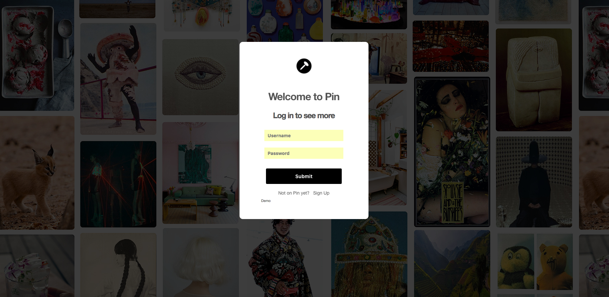
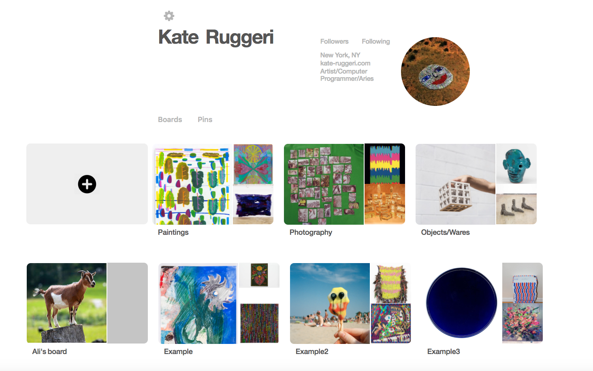
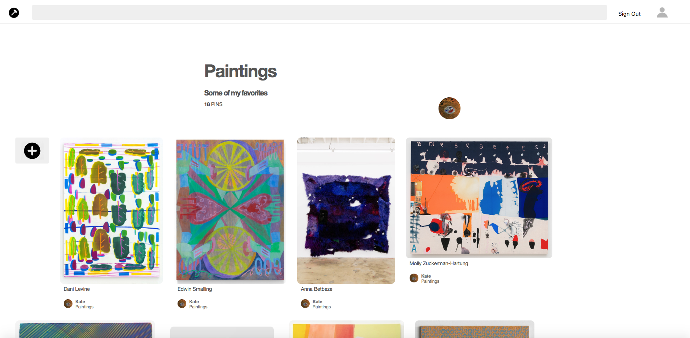
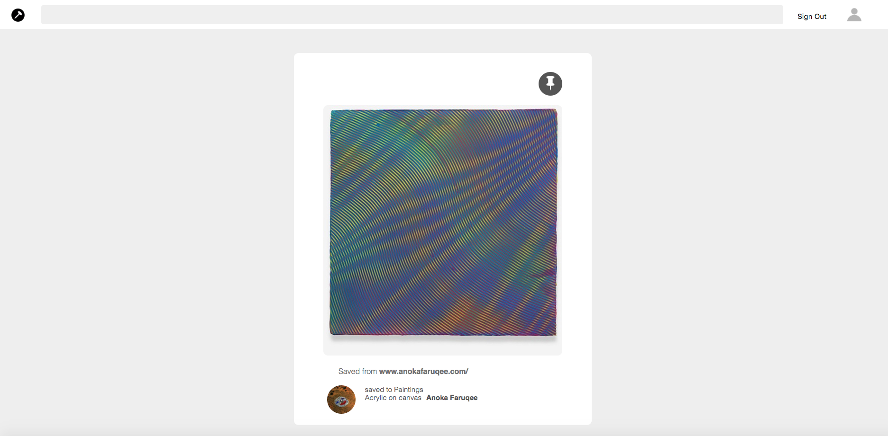

# Pin

[Pin](https://p-i-n.herokuapp.com/)

Pin is a full-stack web application inspired by Pinterest. It's been altered to look and function more as an artist's portfolio, and was created with collectors/curators in mind.

 It utilizes Ruby on Rails on the backend, a PostgreSQL database, and React.js with a Redux architectural framework on the frontend.

  Pin is made up of the following:

1. New account creation, login, and guest/demo login
2. Profile Page
3. Boards and Pins
4. Followers and Follows
5. Discover home page

Users can create their own "mood boards", which are catalogued on their profile pages. Through each board's page, users can add a new "Pin"--images that have a title, description, and image credit. Users can delete their own individual pins, or an entire board and its' pins.

## Boards

Pins and Boards are stored in the database through a table on the backend. A board belongs to a user, and has many pins. Each board and pin has a user_id, and each pin has a board_id.

Once logged in, an API call is made to the database to retrieve the current user's information. The user is then directed to their profile page, where their boards are rendered. Boards are rendered in two ways: BoardShow components and BoardIndexItem components.

BoardIndexItems are visible on each users' index page. Each item recreates Pinterest's mosaic look, by providing an indicator to the content of each Board.

A new board can be created by filling out a BoardCreateForm which is activated in a Module component. The board is then added to the User's page.

On a board's show page, all of it's Pin Items are visible. Similar to Pinterest, the images are arranged in a semi-salon style in the order in which they were pinned.

## Pins

Once a pin is selected, the user is able to view the Pin's show page. This displays the description, as well as the user who posted it. The look of the page is minimal and meant to showcase the image. If looking at one's own pin, the user can delete the pin using the trashcan icon.

Users can add to their own boards by clicking on the add pin icon, which opens the modal with the CreatePin component. User's can then select to upload a file from their hard drive. On submit this is added to the board's pins.

## Follows

When looking at a user's profile, one can click on 'Followers' or 'Following' to see followers. Clicking on a user's icon, will send the user to the corresponding profile page. A user can unfollow or follow a user by clicking on their follow button, which will either execute the corresponding action. 

## Discovery

The discovery page can be reached through the Pin icon in the header. This shows all of a user's followings' pins.  
